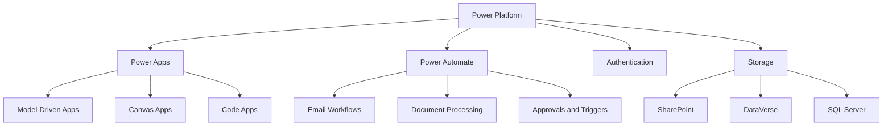
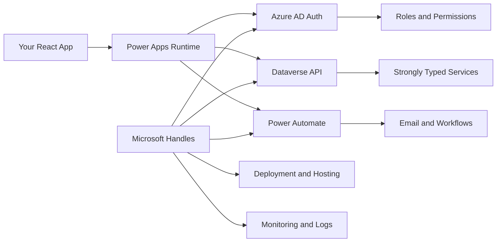

## The Wake-Up Call

I recently started work with a Microsoft shop. And now that I'm in, I realize how many other organizations – the boring, enterprise kind – run entirely on Microsoft.

> **Microsoft Shop**: An organization that standardizes on Microsoft technologies across their entire tech stack. Everything from Office 365 for productivity, Azure AD for authentication, SharePoint for document management, to Power Platform for custom applications. They rely on Microsoft's ecosystem for support, compliance, and certified consultants.

Rightly so.

They're not tech companies. They want to outsource as much tech as possible to someone reputable. Someone they can call when things break. Someone who provides certified consultants and contractors.

Healthcare companies, supermarkets, governments, non-profits – they all rely religiously on Microsoft technologies. For better or worse.

## My Journey (A Quick Flashback)

The first role I ever landed as a software engineer was with a bank. Back then, we were called **System Developers**. And we used .NET for everything.

That was many years ago. Too many to mention here.

Back then, everything ran on local computers. Windows folders. Daily files. I remember running Visual Basic scripts that would scrape those folders, and push data for consumption in [Crystal Reports](https://www.sap.com/products/data-cloud/crystal-reports.html). I didn't understand half of it. But it felt impressive.

Fast forward to today. Everything's changed. Thanks to [Office 365](https://www.office.com/), there's now this thing called [Power Platform](https://www.microsoft.com/en-gb/power-platform). And many other technologies between them.

## What Even Is Power Platform?

> I'd seen Power Platform and its connectors in many places. But I dismissed it. One of those Microsoft things that real developers don't bother with, right? Something for people with low skills. Or so I thought.

You see the certifications: Power Platform; Power Apps. You scroll right past them on LinkedIn. Who needs that when you're building real software?

Turns out, I was wrong. Dead wrong.

**Power Platform** is where Microsoft's enterprise technologies come together. And it's more powerful than I ever gave it credit for.

### Power Automate

Think workflow automation in a secure environment. Like Apache Airflow, maybe. Or [Zapier](https://zapier.com). Or [n8n](https://n8n.io).

I used to use an old Apache platform for this stuff. Can't remember the name. We eventually moved away from it because it was ancient. I tried introducing more Kubernetes-native solutions. [Airflow](https://airflow.apache.org/). [KNative](https://knative.dev/docs/#problems-knative-solves). [OpenFaaS](https://www.openfaas.com/). You get the idea.

Power Automate does all of this. Serverless functions. API triggers. The whole nine yards.

### Power Desktop

I haven't fully wrapped my head around this one yet. So if you know what it does, drop a comment. I could research it, but I'm lazy.

I've heard people mention web scraping with Power Desktop. Not sure if that's the full picture. Maybe it works with Power Automate. Anyway.

### Power BI

The dashboards thing. Like [Tableau](https://www.tableau.com), but Microsoft. Not what we're here to talk about today.

### Power Apps

This is what matters. The low-code/no-code solution for building small, independent applications for employees in your typical Microsoft shop.

These apps run on desktop. On web. Power Apps even has a mobile launcher. So if you're out and about, you can launch a Power App that a citizen developer on your team built.

## Citizen Developers (Yes, That's a Thing)

Another term I discovered in Microsoft shops. Citizen developers.

These are people who understand the business but aren't developers. They know the processes inside and out. They want to solve specific problems using that knowledge.

Typical use cases:

- Employee Survey
- Reserving the company car
- Booking a meeting room

That last one is actually Perfect Power App territory coming to think of it. At my previous organization, we used Google Calendar for room bookings. You'd create an Event. Select a room, find it's taken, try another. Not intuitive.

A Power App solves this. Launch it. See all rooms. Check availability. Book it.

The beauty of all of this is that Power Platform kicks in automatically. All employees are magically available to you. User management. Roles. Authentication. You just focus on the domain-specific modeling.

The data can live in Excel sheets (please don't), SharePoint lists, or SQL Server. But Microsoft introduced something better.

[**Dataverse**](https://learn.microsoft.com/en-us/power-apps/maker/data-platform/data-platform-intro). Their operational database built specifically for Power Apps. Most SQL Servers in these companies handle data warehousing anyway. Mostly read operations. So Dataverse fills the gap.

## The Two Ways to Build Power Apps (Before Code Apps)

Let's say you're building a room booking application. You'd create your schema in Data Verse. Different rooms. Different buildings. Capacity. Available days. Time slots. All that.

Power Apps handles authentication automatically. Users log in with their Microsoft accounts. Boom. Done.

### Model-Driven Apps

Launch your Power App without writing a single line of code. This is called a model-driven application.

Users book rooms. Data sits in Dataverse. Life goes on.

Simple. But limited.

### Canvas Apps

Then came the inevitable problem. People needed more customization. More complicated applications. Because whatever starts with no-code eventually needs more power.

Enter **canvas apps**. The low-code solution to model-driven apps.

You start with a blank slate. Drag-and-drop components. If you want to write code, you can use [Power Fx](https://learn.microsoft.com/en-us/power-platform/power-fx/overview). Think Excel formulas, but for apps.

Canvas apps introduced a pro-code components recently. You build one and release it in your company's Widget Library Grab a widget. Drop it on your page. It will handle events, bind components together, that sort of thing.

You connect your data sources. Wire up your automations with Power Automate. Build complex workflows. Make it look exactly (or so they say) how your designer envisioned.

That's canvas apps. Better than model-driven. But still not what real developers want.

And that's where things get interesting.

## Code Apps: Where This All Comes Together

The crux. The announcement that changed everything.

At Microsoft Build 2025, Microsoft introduced [**Code Apps**](https://learn.microsoft.com/en-us/power-apps/developer/code-apps/overview). A new way to write Power Apps using pro-code instead of no-code or low-code.

Developers can write applications in [React](https://react.dev). In [Vue](https://vuejs.org). In whatever JavaScript framework they prefer. And still leverage the full Microsoft enterprise platform.

Think about it. Databases. Hosting. Automations. All provided.

You just bring the UI. Everything you've learned (or unlearned) from [Tailwind CSS](https://tailwindcss.com), React, state management – you can use it all. Rich user experiences without pre-baked widgets. Without the limitations of model-driven apps.

Code Apps gives you complete freedom. Customization. Styling. You can use [Fluent UI](https://fluent2.microsoft.design) for that Windows look if you want.

The beauty of all of this is that you get all this power without sacrificing the speed and productivity of traditional Power Apps.

## What You Actually Get

**Authentication** out of the box. You piggyback on [Azure AD](https://azure.microsoft.com/en-us/products/active-directory). Roles and scopes provided by the authentication provider. Hide or show parts of your application based on permissions.

Easy.

**Database support** without the deployment headaches. No more provisioning servers. No more database hosting nightmares. You get access to Dataverse, SQL Server, whatever data sources your Power Platform supports.

Hopefully not Excel. Maybe not SharePoint either.

What makes this powerful for developers is the strongly-typed services. The data gets abstracted away. You just get a [TypeScript](https://www.typescriptlang.org) service you can interact with, and Power Apps automatically handles all the data source interactions behind the scenes.

For complicated workflows, Power Automate steps in. HTTP requests. OpenAI calls. Whatever you need. Et cetera, et cetera.

## Why This Matters for You

I'm bullish on this for 2025. For anyone working in enterprise environments.

Banks use Microsoft stacks. Non-profits. Governments. The UN. World Bank. They all run on this.

If you're looking to land a role there or win a contract, you need to pay attention to Code Apps. Watch how this unfolds.

You don't want to come into these organizations and start re-inventing the wheel. They are already stuck with Microsoft. You bringing in Kubernetes, Kafka and Golang will most likely end in tears!

That's where CodeApps comes in to allow us to immediately create value while leveraging our hard-earned coding skills.

## Your Action Plan

**Month 1-2: Get Your Foot in the Door**

- Get [PL-900 certification](https://learn.microsoft.com/en-us/credentials/certifications/power-platform-fundamentals/) (Power Platform Fundamentals)
- Set up a free [Power Apps developer environment](https://powerapps.microsoft.com/en-us/developerplan/)
- Learn [Dataverse](https://learn.microsoft.com/en-us/power-apps/maker/data-platform/) basics

Simple. Achievable.

**Month 3-4: Build Your Portfolio**

- Deep dive into [Code Apps documentation](https://learn.microsoft.com/en-us/power-apps/developer/component-framework/code-components-best-practices)
- Build 2-3 projects combining React + Power Apps
- Get [PL-100 certification](https://learn.microsoft.com/en-us/credentials/certifications/power-platform-app-maker/) (App Maker)

Show your work. Prove your skills.

**Month 5-6: Win the Contracts**

- Update LinkedIn: "Microsoft-certified Power Platform Developer | React/TypeScript"
- Target RFPs from UN agencies, World Bank, government projects
- Network with [Microsoft partners](https://partner.microsoft.com) in your region

This is where it pays off.

Remember my article about the [Telala Effect](/the-telala-effect), about how we lose government tenders because we lack professional processes? This is the solution. Right here.

Get certified. Get your foot through the door. Then do damage with your React and TypeScript skills once you're inside.

The opportunity is there. The door is open.
